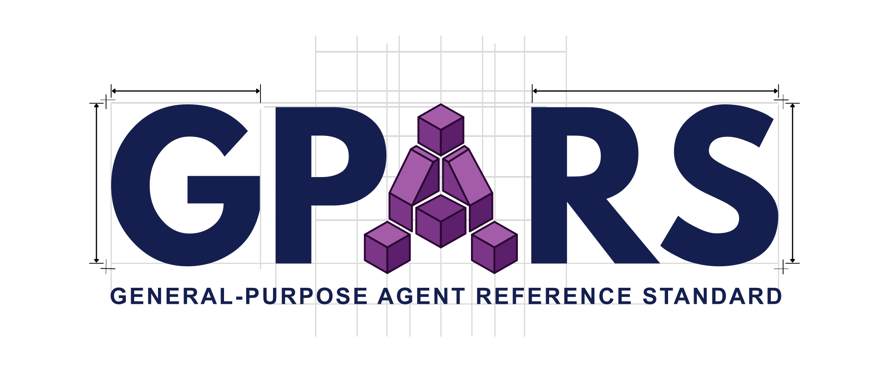
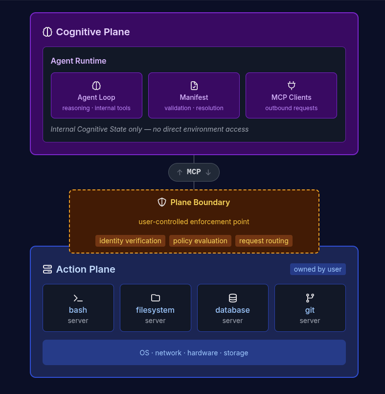

  

  
  
  

  An agent is general-purpose when its capabilities are not limited by what is embedded inside it.

---

GPARS defines a mandatory separation between cognitive reasoning and environment-modifying actions for AI agents. All external operations must be performed through [MCP](https://modelcontextprotocol.io/)-compliant servers — not through embedded tools.

## Why general-purpose?

Agents that embed their tools are special-purpose — their capability surface is fixed at development time. GPARS externalizes all actions via MCP, making the capability surface composable. The same cognitive core can be a coding assistant, a research agent, or a system administrator depending on which MCP servers are available. Specialization comes from the agent loop (system prompts, skills, reasoning) — not from embedded tools.

## Architecture

  

## Key principles

- **Cognitive / Action separation** — agents reason internally but act exclusively through MCP servers
- **User-owned security** — the user controls the Action Plane and defines what agents are permitted to do
- **Declarative manifests** — agents declare what MCP servers they need, not an authorization grant
- **Discovery-based authorization** — agents discover permission boundaries by receiving denials, like OS processes

## Documentation

Read the full docs at **[gpars.io](https://gpars.io)**

## Specification

| | |
|---|---|
| **Spec** | [`spec/v0.1/gpars_v0.1_spec.md`](./spec/v0.1/gpars_v0.1_spec.md) |
| **Schema** | [`spec/v0.1/agent_capability_manifest_schema.json`](./spec/v0.1/agent_capability_manifest_schema.json) |

## Examples

See [`examples/`](./examples/) for sample agent manifests:

| Manifest | Description |
|----------|-------------|
| [`minimal_agent_manifest.json`](./examples/minimal_agent_manifest.json) | Smallest valid manifest |
| [`coding_agent_manifest.json`](./examples/coding_agent_manifest.json) | Coding assistant — bash, filesystem, git |
| [`research_agent_manifest.json`](./examples/research_agent_manifest.json) | Research assistant — browser, database |

## Status

GPARS is currently a **v0.1 draft**. Feedback, questions, and contributions are welcome.

## Author

[Ismael Kaissy](https://github.com/15m43lk4155y)

## Contributing

See [CONTRIBUTING.md](./CONTRIBUTING.md).

## License

This project is licensed under the [MIT License](./LICENSE).
